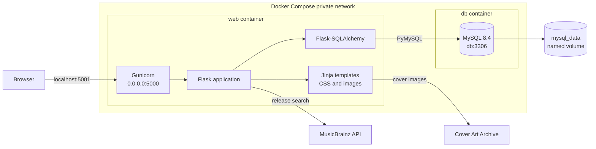
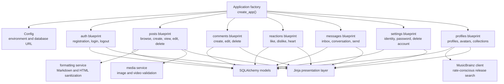
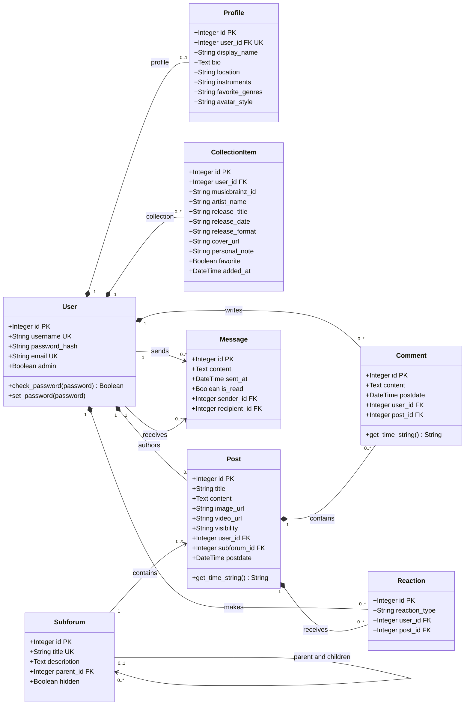
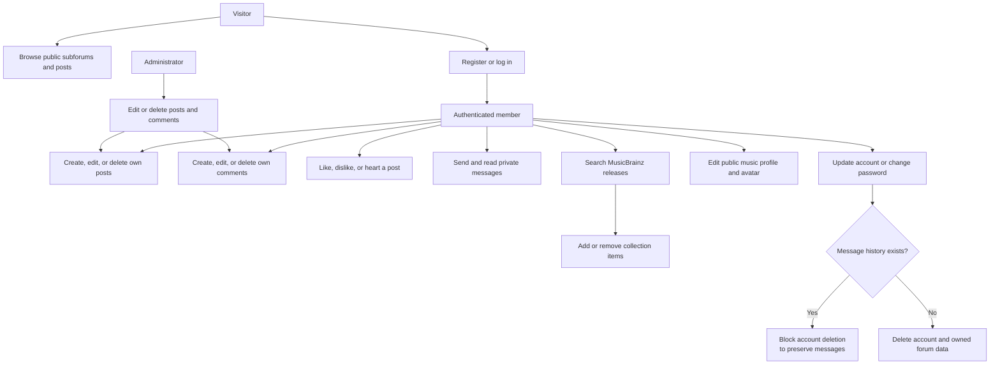

# CircusCircus Lab — UML Diagram (After)

This document describes the final Sound Lab architecture after the forum,
account-management, messaging, media, reaction, profile, music collection, and
Docker features were added.

## 1. Deployment and System Architecture

## 2. Application Components

## 3. Domain Class Diagram

## 4. Main User Flows

## 5. Relationship and Integrity Rules

| Source | Cardinality | Target | Rule |
| --- | ---: | --- | --- |
| User | 1 → 0..1 | Profile | Each user has at most one public profile. |
| User | 1 → many | CollectionItem | A user owns a music collection. |
| User | 1 → many | Post | Deleting an eligible account deletes its posts. |
| User | 1 → many | Comment | Users author comments on posts. |
| User | 1 → many | Reaction | One reaction is allowed per user and post. |
| User | 1 → many | Message | A message has one sender and one recipient. |
| Subforum | 1 → many | Post | Each post belongs to one subforum. |
| Subforum | 0..1 → many | Subforum | Subforums form a parent/child hierarchy. |
| Post | 1 → many | Comment | Deleting a post cascades to its comments. |
| Post | 1 → many | Reaction | Deleting a post cascades to its reactions. |

Additional constraints:

- `Post.visibility` is limited to `public` or `private`.
- `Reaction.reaction_type` is limited to `like`, `dislike`, or `heart`.
- `(Reaction.user_id, Reaction.post_id)` is unique.
- `(CollectionItem.user_id, CollectionItem.musicbrainz_id)` is unique.
- `Profile.user_id` is unique.
- Media is represented by optional URLs on `Post`; it is not a separate entity.
- Passwords are stored as hashes, never as plaintext.
- Account deletion is blocked when direct-message history exists.

## Legend

| Symbol | Meaning |
| --- | --- |
| PK | Primary key |
| FK | Foreign key |
| UK | Unique key |
| `*--` | Composition / cascade-owned relationship |
| `-->` | Association |

