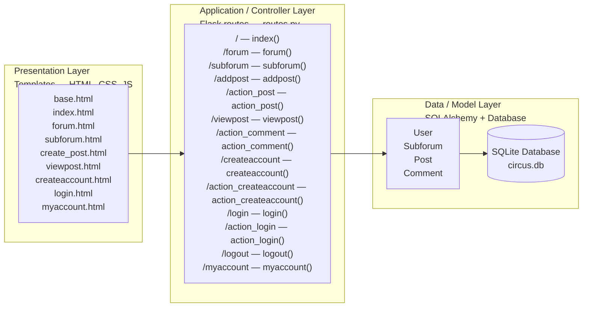
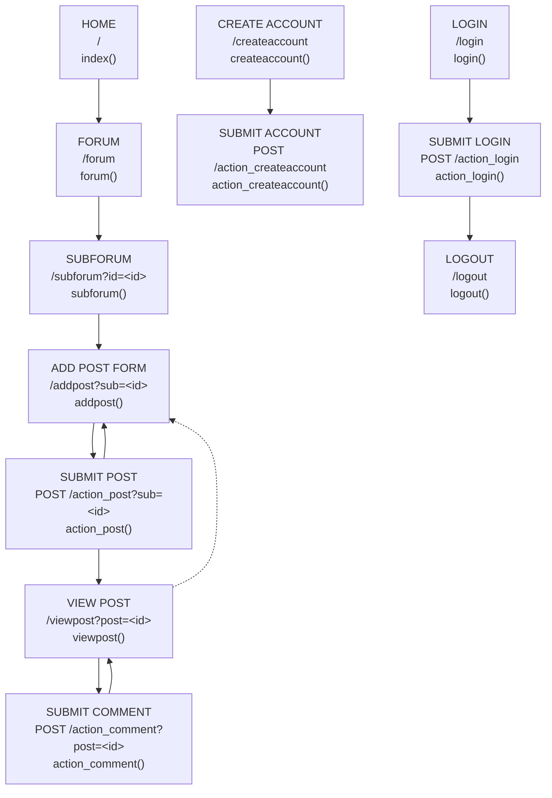
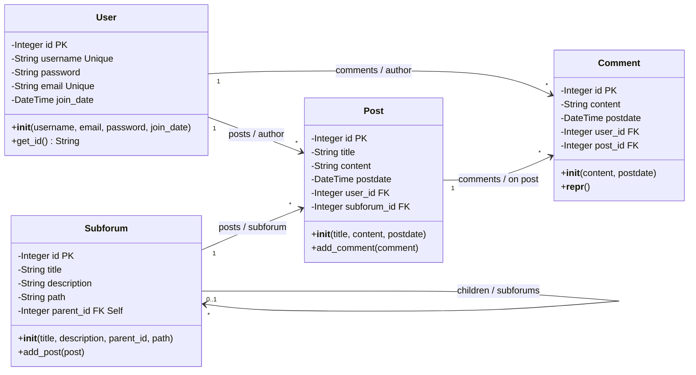

# CircusCircus Lab — UML Diagram (Before)

## 1. High-Level Architecture (Layers)

### Presentation layer templates

| Template |
| --- |
| `base.html` |
| `index.html` |
| `forum.html` |
| `subforum.html` |
| `create_post.html` |
| `viewpost.html` |
| `createaccount.html` |
| `login.html` |
| `myaccount.html` |

### Application routes

| Route | Controller function |
| --- | --- |
| `/` | `index()` |
| `/forum` | `forum()` |
| `/subforum` | `subforum()` |
| `/addpost` | `addpost()` |
| `/action_post` | `action_post()` |
| `/viewpost` | `viewpost()` |
| `/action_comment` | `action_comment()` |
| `/createaccount` | `createaccount()` |
| `/action_createaccount` | `action_createaccount()` |
| `/login` | `login()` |
| `/action_login` | `action_login()` |
| `/logout` | `logout()` |
| `/myaccount` | `myaccount()` |

## 2. Route Map (Flows)

## 3. Class Diagram (Models)

## 4. Key Relationships

| Source | Cardinality | Target | Meaning |
| --- | ---: | --- | --- |
| User | 1 → many | Post | A user creates many posts. |
| User | 1 → many | Comment | A user writes many comments. |
| Post | 1 → many | Comment | A post has many comments. |
| Subforum | 1 → many | Post | A subforum contains many posts. |
| Subforum | 1 → many | Subforum | Self-referencing hierarchy. |

## 5. Notes

- **PK** = Primary Key
- **FK** = Foreign Key
- All relationships are implemented using SQLAlchemy ORM.
- Authentication is handled using Flask-Login (`UserMixin`).
- Passwords are stored securely using `werkzeug.security`.
- Database used: SQLite (`circus.db`).

## Legend

| Diagram element | Meaning |
| --- | --- |
| Model / Entity | A data model persisted through SQLAlchemy. |
| Route — Read (`GET`) | A route that displays existing data. |
| Route — Create (`GET` form / `POST`) | A form or action that creates data. |
| Route — Account Management | Registration, login, or logout flow. |
