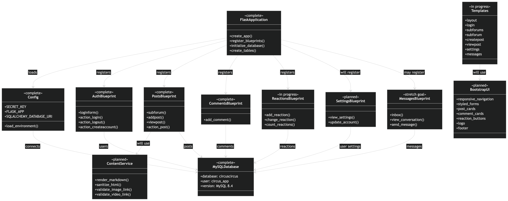
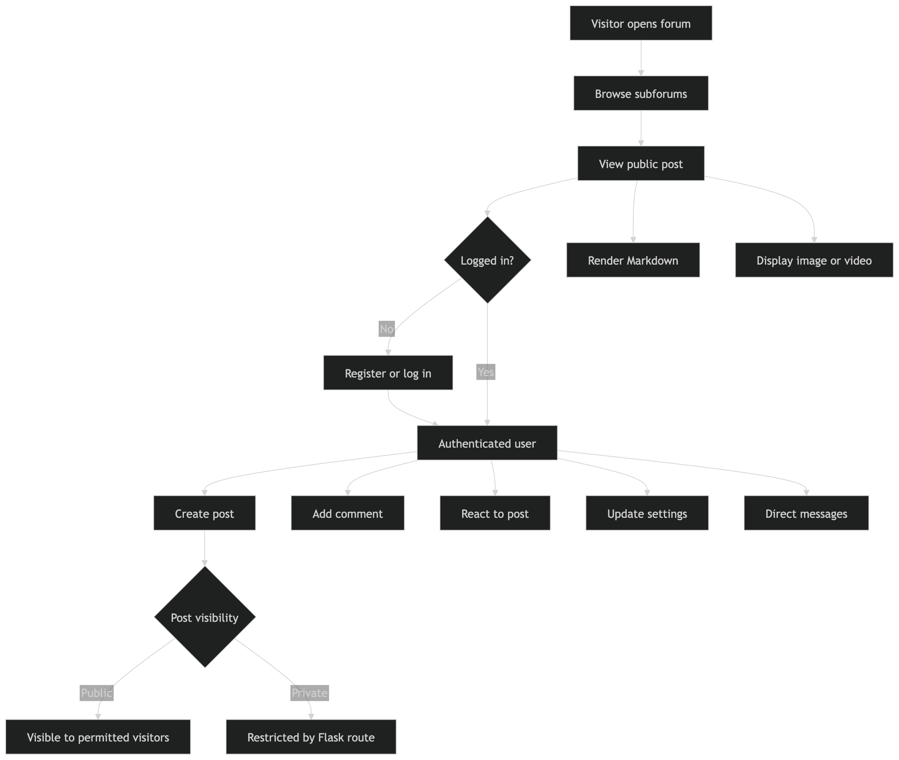
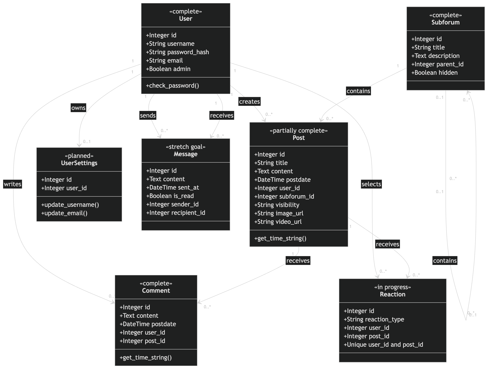
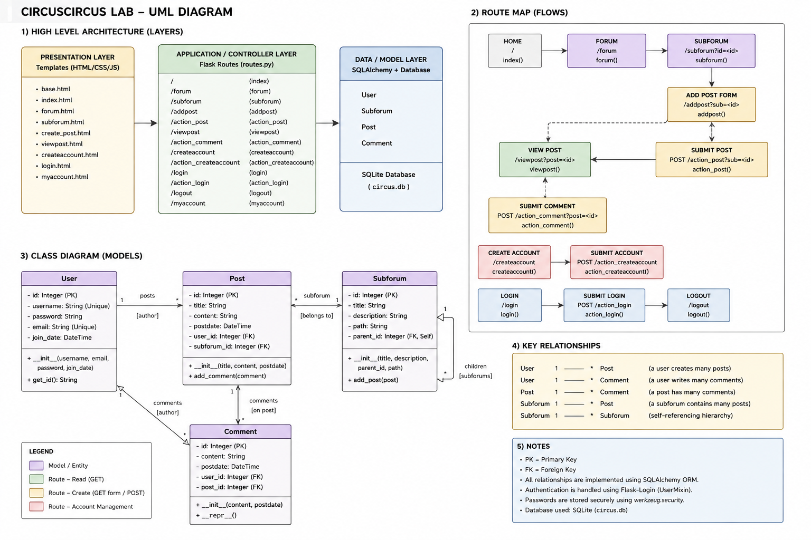

# CircusCircus
This is a minimal forum written in python with Flask. It supports only the bare minumum of features to allow discussions, including user accounts, threads, and comments.

On first run, the default subforums will be created. Although custom subforums are not supported through any user interface, it is possible to modify forum/setup.py to create custom subforums.

## Create a Github Organization

- create an org
- make all group members collaborators
- clone/branch from group's org's repo.
- maintain two branches,`main` & `dev` (plus a different branch for each group member)

## Features to Add

- divide `forum.py` into multiple modules (eg. `posts`, `comments`, `auth (login etc)`)
- migrate from sqlite3 to MySQL
- comments on each post (many comments to one post)
- like/dislike/heart/etc emojis on posts
- direct messages from one user to another
- insert pix links and/or video links
- a nice style based on Bootstrap
  - a logo on every page
  - copyright, about etc on footer of each page
- user settings
- public/private posts
  - public posts can be seen by people not logged in
  - private posts can only be seen by users logged in
- posts can be plain text or markdown

## Changes in 2020

I had to make a bunch of changes in this code to get it running. Took far longer than it should.
But now, if I have it right, you need to clone this and then

This currently puts a sqlite3 db in the /tmp directory.
(use atleast python 3.11)

```
$ python3.11 -m venv venv
$ source venv/bin/activate
$ pip install -r requirements.txt
$ ./run.sh
```

and it should appear on port 5000

`http://0.0.0.0:5000`

## Run with Docker

Docker packages the Python runtime, dependencies, and application into the
same reproducible image for every teammate. Install Docker Desktop, start it,
and then run this command from the project root:

```sh
docker compose up --build
```

Open <http://localhost:5001>. The first build installs the Python packages and
downloads MySQL, so it can take a few minutes; later starts reuse Docker's
cache. Compose runs two containers: `web` runs Flask through Gunicorn and `db`
runs MySQL 8.4. Flask reaches MySQL at the hostname `db` on Compose's private
network. The `mysql_data` Docker volume keeps the database when containers are
recreated.

The `APP_PORT` value in `.env` controls the Mac-side port. It defaults to 5001
because macOS may reserve port 5000; Gunicorn still listens on port 5000 inside
the container.

Before starting, copy `.env.example` to `.env` and replace every placeholder.
Compose reads this local file to configure both services, while `.gitignore`
prevents its secrets from being committed.

Useful commands:

```sh
# Start again without rebuilding when no dependencies changed.
docker compose up

# Stop and remove both containers. The mysql_data database volume remains.
docker compose down

# Follow application output while the container is running in the background.
docker compose logs --follow web

# Run the test suite in the same app image. Tests use isolated in-memory data.
docker compose run --rm web python -m unittest discover -s tests
```

Do not use `docker compose down --volumes` unless you intentionally want to
delete the Dockerized MySQL database. Never commit the local `.env` file.

See [the SoundLab Docker guide](Docs/docker.md) for the architecture, complete
teammate setup, startup sequence, and troubleshooting explanations.

## Changes in 2023

database is now in `instance/` directory
removed version labels from `requirements.txt`

The Heroku file is broken.
The Procfile is broken too.





